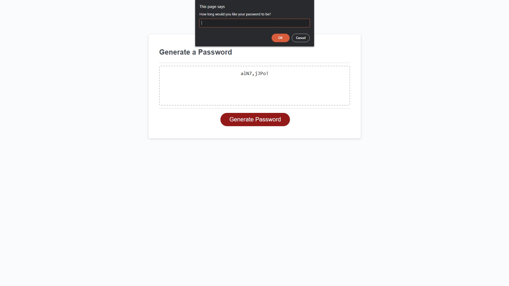
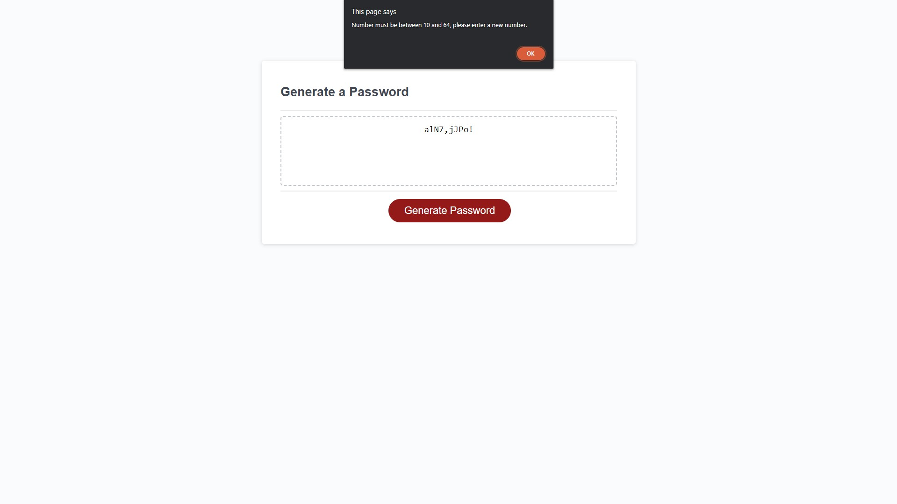
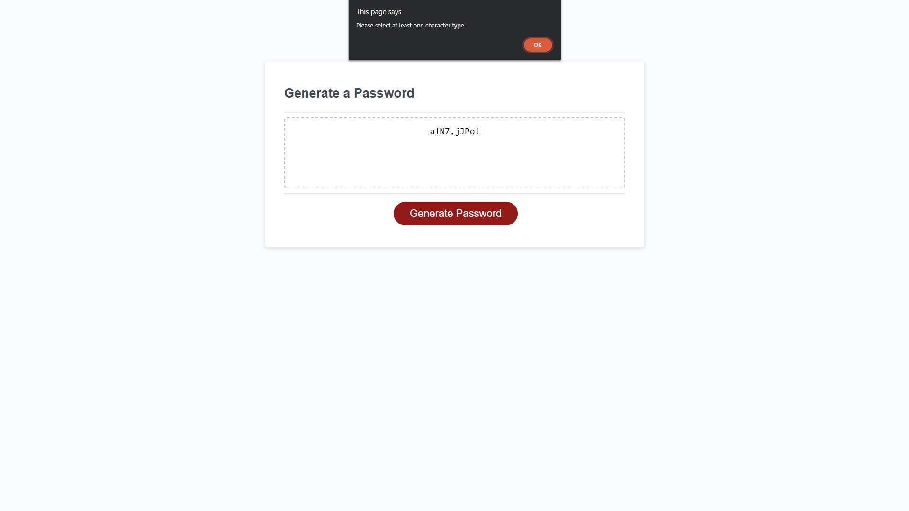

# Bootcamp_Week5_Challenge

## Random password generator

In this project, I created a random password generator where users can choose the length of the password and what character types to use for their passwords, and the generator will create a password accordingly.
When the user inputs choices that don't allow for the creation of a secure password, the generator will throw an error prompt and tell the user to select other options, such as adding other character types or a different number of character.

## Screenshots

